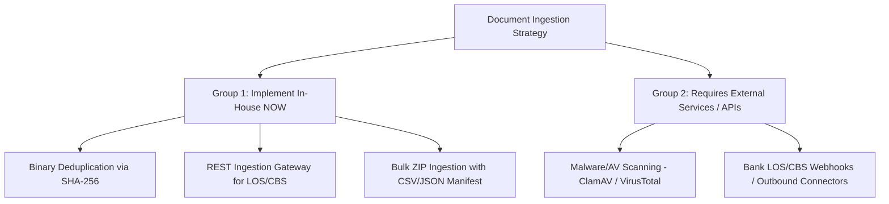

# Document Ingestion Architecture & Capability Analysis
**Banking Document Management System (DMS)**

---

## Executive Summary

This document outlines the **Document Capture & Ingestion** capabilities for the Banking DMS, categorized by what can be built **immediately in-house**, what requires **external third-party APIs/services**, and the corresponding implementation roadmaps.

---

## 1. Capability Breakdown & Readiness Matrix

| Feature | Can We Do It Now? | Requires External API / Infrastructure? | Effort / Time |
|---|---|---|---|
| **1. Document Upload / Capture** | ✅ **Already Done** | No (Uses existing Multer + Gemini/OpenAI OCR) | — |
| **2. Binary Deduplication (SHA-256)** | 🚀 **Can Do NOW** | **No** (Uses Node.js native `crypto`) | 1–2 hours |
| **3. API-based Ingestion (LOS/CBS/CRM)** | 🚀 **Can Do NOW** | **No** (Builds REST Ingestion Gateway + API Key Auth) | 3–4 hours |
| **4. Bulk ZIP Ingestion with Manifest** | 🚀 **Can Do NOW** | **No** (Uses existing `adm-zip` + CSV/JSON parser) | 3–4 hours |
| **5. Anti-Virus / Malware Scanning** | ⏳ **Requires External Service** | **Yes** (ClamAV Docker Daemon OR VirusTotal/Cloudmersive API) | 1 day |

---

## 2. Detailed Breakdown by Category



---

### GROUP 1: What We Can Build RIGHT NOW (100% In-House, No Extra Cost)

These features require **no external subscriptions, no third-party APIs**, and can be coded directly into your Node.js backend:

#### A. Binary Content Deduplication (SHA-256)
* **How it works:** When a document is uploaded, Node.js computes a cryptographic SHA-256 hash of the file buffer before saving.
* **Functionality:**
  * Checks if another document in the database has the identical `fileHash`.
  * If found, prevents redundant cloud storage consumption and warns the user: `"Exact duplicate of existing file (ID: DOC-1029) detected"`.
  * Supports options to either: **Reject duplicate**, **Create linked reference**, or **Attach as a new version**.
* **Dependencies:** Native Node.js `crypto` module (zero external dependencies).

#### B. Headless Ingestion Gateway for LOS / Core Banking / CRM
* **How it works:** Provides dedicated service-to-service REST endpoints for automated ingestion.
* **Endpoint:** `POST /api/ingest/v1/document`
* **Authentication:** System-level API Key & Secret header (`X-DMS-API-Key: ...`).
* **Functionality:**
  * Accepts multipart file + metadata JSON payload (`customerId`, `facilityRef`, `documentType`, `branch`, etc.).
  * Automatically routes document to the correct tenant, department, and customer folder.
  * Runs OCR and metadata validation automatically.
  * Returns ingestion receipt with unique Document Reference ID (`BANK-NST-26-001`).

#### C. Bulk Batch Ingestion (ZIP Archive + Manifest)
* **How it works:** An admin or system drops a `.zip` archive containing 10 to 1,000 files along with a `manifest.json` or `manifest.csv`.
* **Functionality:**
  * Unpacks files into memory/disk.
  * Matches each file to its metadata row in the manifest.
  * Ingests, runs OCR, validates mandatory fields, and indexes all documents in a single background batch job with a progress report.
* **Dependencies:** Existing `adm-zip` library.

---

### GROUP 2: What Requires External APIs / Services / Infrastructure

These features require external tools, third-party subscriptions, or access to the bank's internal systems:

#### A. Anti-Virus & Malware Scanning
To scan files for viruses, trojans, or ransomware before they enter your DMS, you need an anti-virus engine.

**Options for Implementation:**

| Solution | Type | Pros | Cons / Requirements |
|---|---|---|---|
| **Option 1: ClamAV Daemon** *(Recommended for Self-Hosted)* | Open-Source Docker Container | Free, open-source, runs inside your Docker network alongside DMS | Requires adding a `clamav/clamav` container in `docker-compose.yml` (consumes ~1GB RAM). |
| **Option 2: Cloudmersive Virus Scan API** | Managed Cloud API | No infrastructure to manage, instant REST integration | Requires API Key (Free tier has 800 calls/month; Paid plans start at $19/mo). |
| **Option 3: VirusTotal API** | Cloud API | Industry standard multi-engine scanner | Rate limits on free tier (4 files/min); requires API Key. |
| **Option 4: AWS GuardDuty / S3 Antivirus** | AWS Native | Integrates with S3 storage buckets | Requires AWS cloud deployment. |

#### B. Live Outbound Triggering from the Bank's Core LOS / CBS
* **Requirement:** To automatically pull documents when a loan is sanctioned in the bank's LOS (e.g. FinnOne, Finacle, Temenos, Salesforce), the bank's IT team must configure an outbound Webhook or API client that sends files to our `POST /api/ingest/v1/document` endpoint.

---

## 3. Recommended Implementation Roadmap

```
┌─────────────────────────────────────────────────────────────┐
│ Phase 1: Implement In-House (Today)                         │
│ • SHA-256 Binary Content Deduplication                      │
│ • External Ingestion API Gateway (/api/ingest/v1/document)  │
│ • Bulk ZIP Ingestion Engine with Manifest                   │
└──────────────────────────────┬──────────────────────────────┘
                               │
                               ▼
┌─────────────────────────────────────────────────────────────┐
│ Phase 2: Add Anti-Virus Protection                          │
│ • Add ClamAV container to docker-compose.yml                │
│ • Hook scanning middleware before storage upload            │
└──────────────────────────────┬──────────────────────────────┘
                               │
                               ▼
┌─────────────────────────────────────────────────────────────┐
│ Phase 3: Bank System Handshake                              │
│ • Provide API Documentation / OpenAPI Spec to Bank LOS/CBS  │
│ • Generate API Keys for external banking systems            │
└─────────────────────────────────────────────────────────────┘
```
